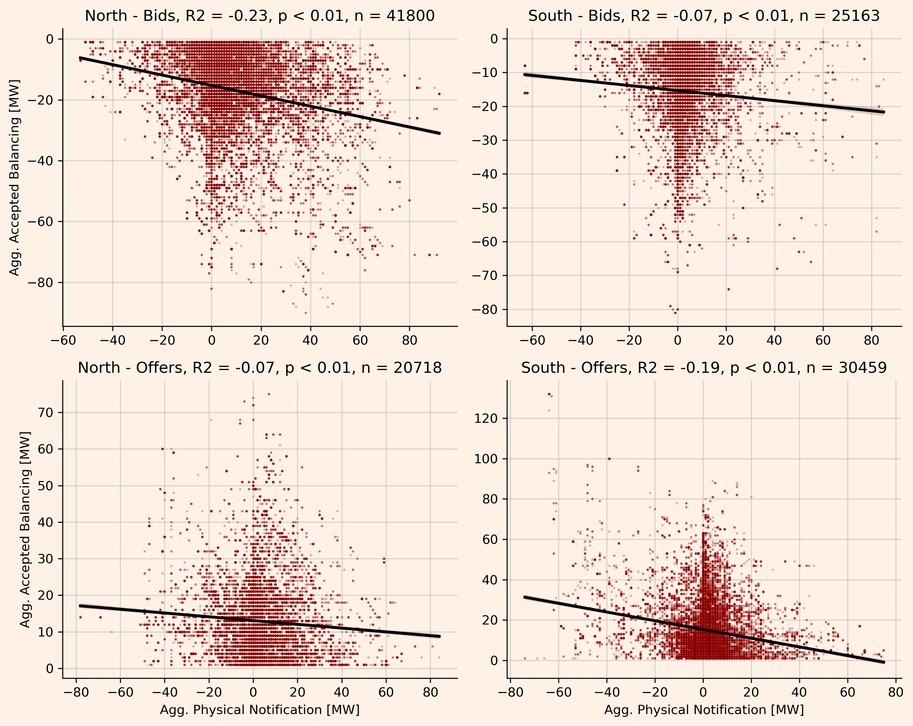
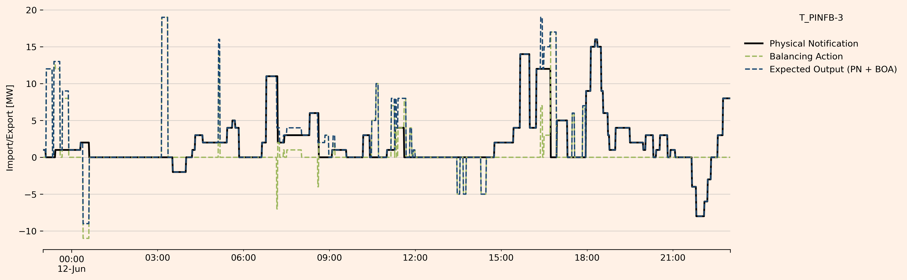

### Do batteries contribute to the problems they rectify in the BM?

#### Summary

* Batteries are an important contributor to balancing actions in the UK power systems.
* However, it stands to reason that some of the grid constraint they alleviate are exacerbated through their own activity on the wholesale market.
* This note investigates, and finds some supporting evidence to this hypothesis.
* We show three things:
    1. In northern Scotland (north of the central belt; probably north of B4), we statistically prove that for a random subset of batteries:
        - Between March 25 and July 17, whenever _any_ of the batteries has accepted bids, the summed export of the same batteries is positively correlated with their summed accepted bid volumes. 
    2. South of the B4 boundary, we statistically prove that for a random subset of batteries:
        - Between March 25 and July 17, whenever _any_ of the batteries has accepted offers, the summed import of the same batteries is positively correlated with their summed accepted offer volumes. 
    3. The opposite correlation, bid vs export volumes south of B4 and offer vs import volumes north of B4, are significantly less pronounced.
* **Methods**: To show this, 
    * We use Elexon's data on Physical Notification (PN) and Bid-Offer Acceptance (BOA)  
    * of four random batteries south of B4 and of four random batteries north of B4, 
    * compile their Elexon data into a minutely timeseries of wholesale and balancing activity,
    * and determine Pearson correlations with respective _p_-values for the subset of minutes where any balancing activity is observed.

**Main Figure - Correlation of Balancing and Wholesale volume during Battery Bidding and Offer Activitiy South and North of the UK**

#### Detailed Methods and Results

* Using Elexon data for each BM unit (here T_PINFB-3), we get a timeseries

.
* This data spans from March 25th 2024 and July 17th 2024, and is compiled to a timeseries of PN and BOA activity with a temporal resolution of one minute.
* The series are summed over all batteries.

