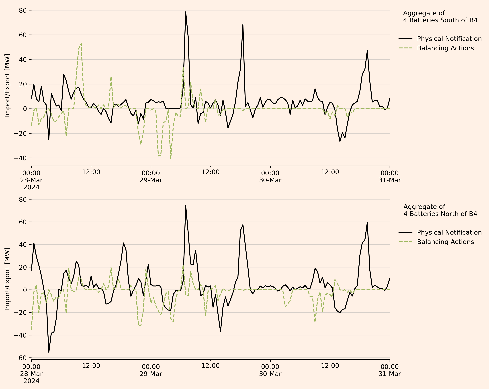
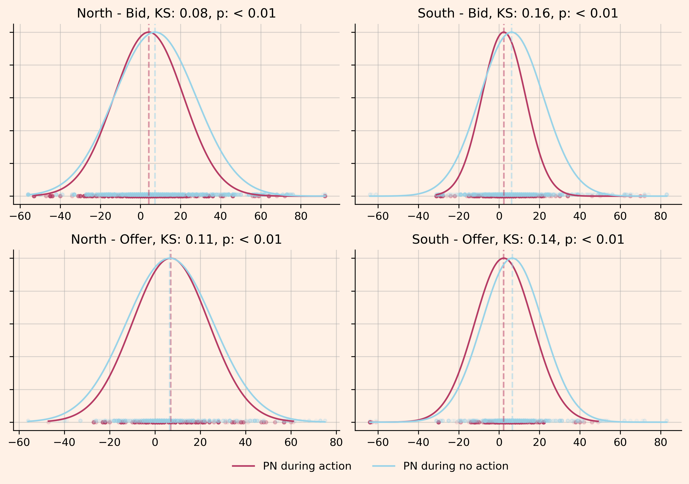

### Do batteries contribute to the problems they rectify in the Balancing Market?

#### Summary

* Batteries are an important contributor to balancing actions in the UK power systems.
* However, it stands to reason that some of the grid constraints they alleviate are exacerbated through their own activity on the wholesale market.
* This note investigates and finds some supporting evidence for this hypothesis.
* We show three things:
    1. In Northern Scotland (North of the central belt; probably North of B4), we statistically prove that for a random subset of batteries:
        - Between March 25 and July 17, whenever _any_ of the batteries have accepted bids, the summed export of the same batteries is positively correlated with their summed accepted bid volumes. 
    2. South of the B4 boundary, we statistically prove that for a random subset of batteries:
        - Between March 25 and July 17, whenever _any_ of the batteries have accepted offers, the summed import of the same batteries is positively correlated with their summed accepted offer volumes. 
    3. The opposite correlation, bid vs export volumes South of B4 and offer vs import volumes North of B4, is significantly less pronounced.

 

* **For i. and ii., the magnitude of the correlation indicates that approximately every 4th to 5th unit of power provided in balancing meets a constraint they caused.**

 

* **Methods**: To show this, 
    * We use Elexon's data on Physical Notification (PN) and Bid-Offer Acceptance (BOA)  
    * of four random batteries South of B4 and of four random batteries North of B4, 
    * compile their Elexon data into a minutely time series of wholesale and balancing activity,
    * and determine Pearson correlations with respective _p_-values for the subset of minutes where the respective balancing activity is observed.

**Main Figure - Correlation of Balancing and Wholesale Volumes During Battery Bidding and Offer Activity South and North of the B4 Boundary**

* Each point refers to one minute of _aggregated_ wholesale and balancing activity, where at least one of the four random (North or South) batteries had bids accepted (offers in the plots labelled 'Offers').

* The line shows a linear fit of the data, with the respective Pearson R², and _p_-value shown in the title of the plot.

* The main results are top-left and bottom-right, showing the expected dynamic.
    * Top-left: Bid volumes in the North are larger during high exports.
    * Bottom-right: Offer volumes in the South are larger during high imports.
    * Top-right and bottom-left: the same dynamics for bids in the South and offers in the South are noticeably less pronounced.

#### Methods, Limitations, and Discussion

* Using Elexon data for each BM unit (here battery T_PINFB-3), we get a time series of the asset's activity both in the wholesale and the balancing market.

* For the respective four batteries, we aggregate both PN and BOA data.

* Enhancing the scope of the data to span from March 25th 2024 to July 17th 2024, we get

* All code used can be found in `notebooks/battery_analysis.ipynb`.

**Limitations** 
* While the choice of batteries is random, an analysis based on more assets would be more reliable.
* An alternative framing of the results could investigate if the battery's behaviour on the wholesale market is different depending on its activity on the balancing market. This could be tested using a Kolmogorov-Smirnov test, and is shown here for a small dataset of a few days. Here, it was found to be insufficiently intuitive.

