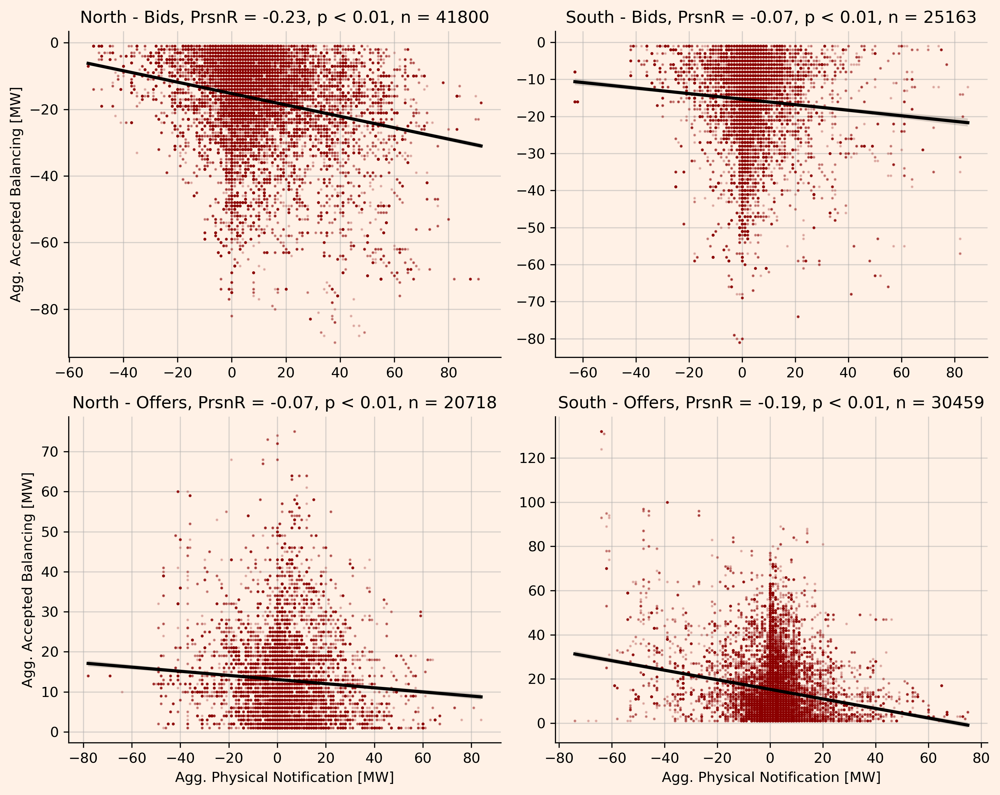
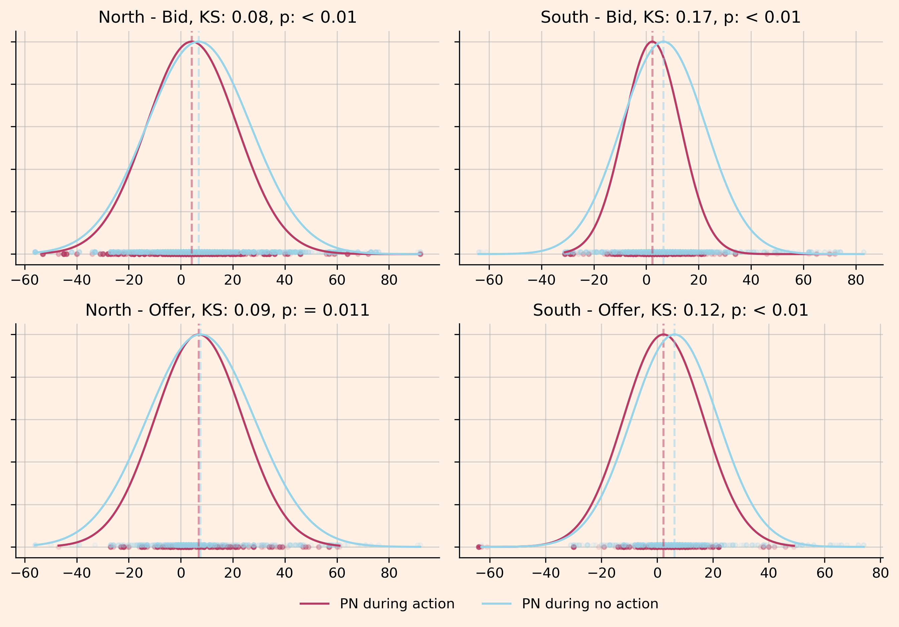

### Do batteries contribute to the problems they rectify in the Balancing Market?

#### Summary

* Batteries are an important contributor to balancing actions in the UK power systems.
* However, it stands to reason that some of the grid constraint they alleviate are exacerbated through their own activity on the wholesale market.
* This note investigates, and finds some supporting evidence to this hypothesis.
* We show three things:
    1. In Northern Scotland (North of the central belt; probably North of B4), we statistically prove that for a random subset of batteries:
        - Between March 25 and July 17, whenever _any_ of the batteries has accepted bids, the summed export of the same batteries is positively correlated with their summed accepted bid volumes. 
    2. South of the B4 boundary, we statistically prove that for a random subset of batteries:
        - Between March 25 and July 17, whenever _any_ of the batteries has accepted offers, the summed import of the same batteries is positively correlated with their summed accepted offer volumes. 
    3. The opposite correlation, bid vs export volumes South of B4 and offer vs import volumes North of B4, are significantly less pronounced.
* **Methods**: To show this, 
    * We use Elexon's data on Physical Notification (PN) and Bid-Offer Acceptance (BOA)  
    * of four random batteries South of B4 and of four random batteries North of B4, 
    * compile their Elexon data into a minutely timeseries of wholesale and balancing activity,
    * and determine Pearson correlations with respective _p_-values for the subset of minutes where any balancing activity is observed.

**Main Figure - Correlation of Balancing and Wholesale Volumes During Battery Bidding and Offer Activity South and North of the B4 Boundary**

* Each point refers to one minute of _aggregated_ wholesale and balancing activitiy, where atleast one of the four random (North or South) batteries had bids accepted (offers in the plots labelled 'Offers').

* The line shows a linear fit of the data, with the respective Pearson R2, and _p_-value shown in the title of the plot.

* The main results are top-left and bottom-right, where the expected results are seen.
    * top-left: Bid volumes in the North are larger during high exports.
    * bottom-right: Offer volumes in the South are larger during high imports.
    * top-right and bottom-left: the same dynamics for bids in the South and offers in the South are noticeably less pronounced.

#### Methods, Limitations, and Discussion

* Using Elexon data for each BM unit (here battery T_PINFB-3), we get a timeseries of the assets activity both in the wholesale and the balancing market.

* For the respective four batteries we aggregate both PN and BOA data.

* Enhancing the scope of the data to span from March 25th 2024 to July 17th 2024, we get

* All code used can be found in `notebooks/get_bmudata.ipynb`.

**Limitations** 
* While the choice of batteries is truly random, an analysis based on more results would be more reliable.
* An alternative framing of the results could investigate if the battery's behaviour on the wholesale market is different depending on its activity on the balancing market. This could be tested using a Kolmogorov-Smirnov test, and is shown here for a small dataset of a few days, but is visually less intuitive.

* Finally, Figure 2 shows that much of the batteries' BM activity is to provide power during very small time frames, often of only a few minutes. Moreover, these actions are not soFlagged which would indicate the relevance of network constraints. Also, Figure 1 and 4 suggests that it could be plausible that only a few, high-power balancing actions are driving the majority of the observed effect.
    * Further analysis could investigate this deeper, and disaggregate the analysis to different types of balancing actions.
